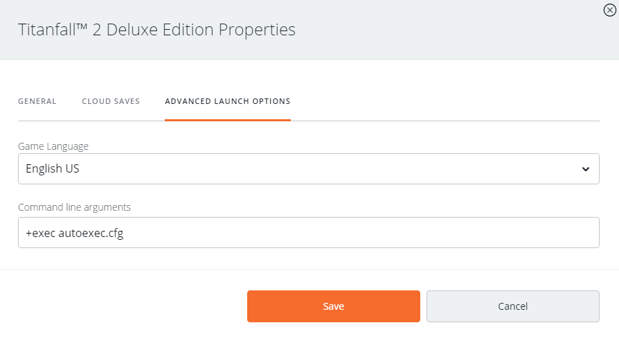

# 击杀音效


Too many sounds playing at once may cause stutter. Make your sound as short as possible to prevent multikills from causing stutter.


## Preparation <a id="preparation"></a>

Navigate to your folder and find this folder:

> Origin Games\Titanfall2\vpk\

Copy these file and paste them in an empty folder somewhere else:

* englishclient\_mp\_common.bsp.pak000\_dir.vpk
* client\_mp\_common.bsp.pak000\_000.vpk

You will need the Titanfall VPK Tool, the program which will allow you to open and repack Titanfall VPK files and RAD Tools Bik, which lets you convert videos to the BIK format, both found [here.](https://noskill.gitbook.io/titanfall2/how-to-start-modding/modding-tools)​

## Unpacking <a id="unpacking"></a>

Now that these files have been backed up and everything installed, navigate to your game folder and open this file using the VPK tool:

> Origin Games\Titanfall2\vpk\englishclient\_mp\_common.bsp.pak000\_dir.vpk

​[How to extract VPK's properly?](https://noskill.gitbook.io/titanfall2/how-to-start-modding/how-to-backup-extract-and-repack)​

## Editing

To add a killsound edit this file using Notepad:

> EXTRACTED-VPK\scripts\vscripts\client\cl\_obituary.gnut

and use `CTRL+F` to search for `string victimString` on line 255.

Place this under `string victimString`

```cpp
    if(attacker == GetLocalClientPlayer())
    {
        GetLocalClientPlayer().ClientCommand("killsound")
    }
```

The final product should look like this:

```cpp
	string attackerString
	string weaponString
	string victimString
	
	if(attacker == GetLocalClientPlayer())
	{
		GetLocalClientPlayer().ClientCommand("killsound")
	}
```

After editing the file save it and move to the next step.

## Creating autoexec.cfg <a id="autoexec"></a>

To easily change your killsound you need to use a config file.

start by creating a file named **autoexec.cfg** in:

> Origin Games\Titanfall2\r2\cfg

After creating the file open it with Notepad and paste the following in the file:

```cpp
alias killsound "playvideo killsound 1 1 1; playvideo killsound 1 1 1"
```


Playing the sound twice is intentional, this amplifies its volume.


After saving add: **`+exec autoexec.cfg`** to your launch options for Titanfall in Origin.  




## Converting sounds <a id="converting"></a>

To use custom sounds in Titanfall 2 we need to use a workaround and play them as video instead. Use RAD Tools to convert a video with sound to a .bik video. The sound HAS to be a video for it to work.

Open RAD Tools and navigate to the location of your downloaded video. Select the video and press the **BINK IT!** button. In the menu that opens name the sound to **killsound.bik** and press the **Bink** button on the right side of the window.

After binking the video move the new **killsound.bik** to

> Origin Games\Titanfall2\r2\media


Try to trim out as much silence from the start of the file as possible to negate delay.


## Repacking <a id="repacking"></a>

​[How to repack VPK files properly ?](https://noskill.gitbook.io/titanfall2/how-to-start-modding/how-to-backup-extract-and-repack#how-to-repack-vpk-files-properly)​

After following step by step the previous link

Rename pak000\_000.vpk _to_ **client\_mp\_common.bsp.pak000\_000.vpk**

Rename pak000\_dir.vpk _to_ **englishclient\_mp\_common.bsp.pak000\_dir.vpk**

Place both of the renamed files back into your game directory and then launch Titanfall 2 and kill some pilots to test your sound.

> Origin Games\Titanfall2\vpk\

