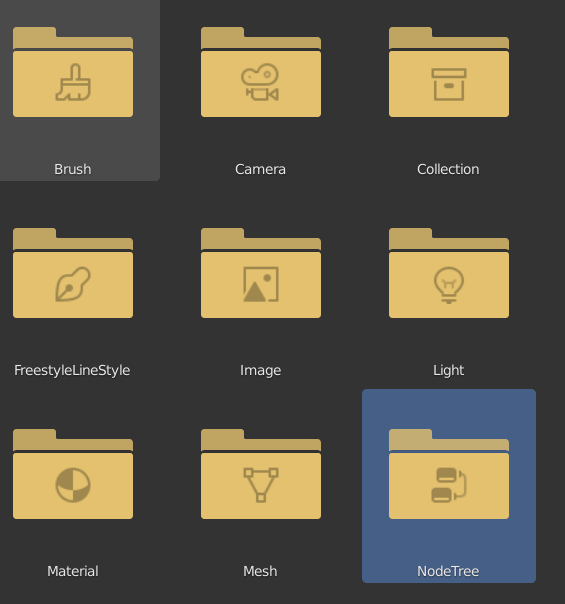
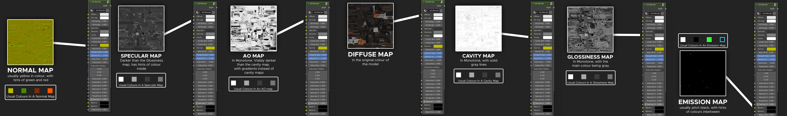

# Exporting Models

## Required Software

* Blender
  * Blender Source Tool - For importing models into blender
  * S/G Shader - For linking textures
* Legion - RPAK ripping tool
* Crowbar - Source Engine model tool
* Titanfall VPK Tool - Titanfall VPK tool


Check down bellow for the tools page where all the link are provided



[tools](../intro/duction/tools/)


## Getting The Models

First, we need to actually obtain the models. You can do this by extracting this VPK file you can learn how to extract VPKs


[vpk-packpack.md](../intro/duction/vpk-packpack.md)


For the most part, models can be found in the common vpk. But you will find other models in the other vpk from Titanfall 2.

```
"Titanfall2\vpk\englishclient_mp_common.bsp.pak000_dir.vpk"
```

Next, you need to find the model you want. In this guide, as an example, the CAR SMG will be chosen. Which is located here

```
ExtractedVPK\models\weapons\car101
```

However, we can't just straight import this into blender, we will need to decompile the model using crowbar. So first, extract crowbar using your archive software of choice, and load up `crowbar.exe`


Once you've decompiled the model into the folder of your choice, we need to open up blender and install blender source tools.


## Importing The Models

Next, we need to import the models using blender source tools. This can easily be done by clicking on `File > import`, and importing the `.qc` file as shown


After the model is imported, if you zoom out it should look like this


As you can see, it has addons equipped, such as the proscreen. We can delete this as shown below


## Texturing The Model

Finally, we can begin to texture our model, this is perhaps the most tedious step, so buckle up





Now, we need to link up the textures to the blender node, however. we need to figure out which texture is which type. I've created a handy little image to help you identify them



Link them up using the visual guide above


## Congrats!

Once its all textured up, your model should look like this, congrats!


